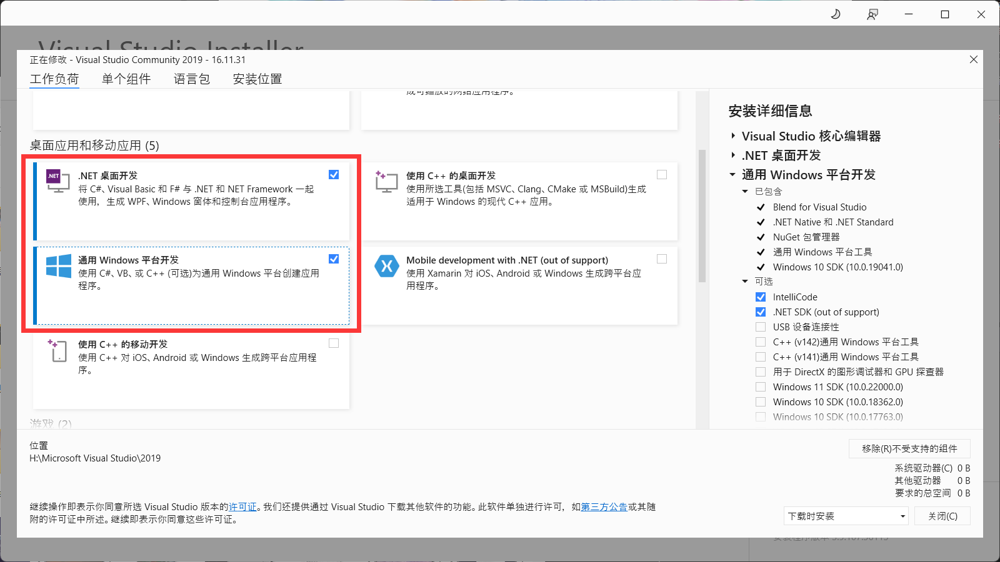
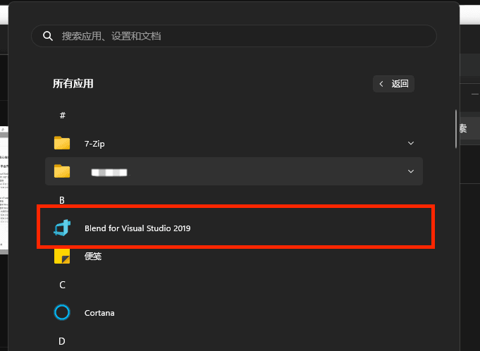
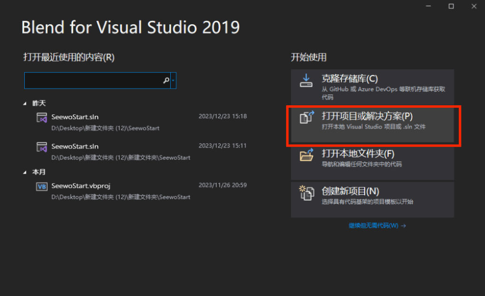

 
<a href='github的开源路径'></img></a>
<h1>希沃·定制启动器 V4.0</h1>
</h1>
 

 

#### 介绍
制作本启动器的原因是视频网站上一搜希沃白板，就会有很多教程去教我们咋替换启动页面，为了避免这种群魔乱舞的现象,思锐工作室开发出了一款希沃定制启动器，于23年10月1.0定制启动器发布，23年12月2.0正式版发布，24年2月3.0发布，24年10月4.0发布,来用我们的启动器来让任何软件联动启动！

#### 软件架构
使用Microsoft Visual Basic .NET实现的定制启动器

#### 定制启动器-安装程序
在2024年10月04日这一天，我们成功的发布了第3版希沃·定制启动器-安装程序:[点此下载](https://disk.srinternet.top/d/%E5%B8%8C%E6%B2%83%E5%AE%9A%E5%88%B6%E5%90%AF%E5%8A%A8%E5%99%A8/%E5%AE%9A%E5%88%B6%E5%90%AF%E5%8A%A8%E5%99%A82.0%E8%87%AA%E5%8A%A8%E5%8C%96%E5%AE%89%E8%A3%85%E7%A8%8B%E5%BA%8F.exe)
希沃·定制启动器-安装程序实现了自动下载和安装，在开始页面，需要我们选择希沃白板启动器的文件夹路径，安装在C盘的路径默认是"C:\Program Files (x86)\Seewo\EasiNote5\swenlauncher"，点击后将会自动主安装程序，同样点击下一步，输入启动器文件夹路径，可以直接粘贴，后点击完成，后面将自动更新并打开自动打开图形化的定制启动器 设置页面，之后要再次打开设置页面，可右键希沃白板快捷方式，打开文件所在路径，找到配置定制启动器.bat,双击打开即可！（具体请查看使用教程)

#### 使用说明

 :point_right: [点此查看使用教程视频](https://www.bilibili.com/video/BV1eC4y1D73H/)

#### 开源
1.0发布时我们承诺过，播放量过1万就开源，别担心，我们的承诺必将做到，这不就来了吗，具体部署教程请看源代码部署

#### 源代码部署
 部署源代码需Windows环境，需要以下软件:
1.Blend for Visual Studio 2019
!!!注意，必须2019 用2022会报错!!!
因为2019官网早就下架了，所以我们打包了一个安装程序
[点此下载](https://disk.srinternet.top/d/%E5%B8%8C%E6%B2%83%E5%AE%9A%E5%88%B6%E5%90%AF%E5%8A%A8%E5%99%A8/VS2019/VS-2019%E5%AE%89%E8%A3%85%E7%A8%8B%E5%BA%8F.exe)
记住，安装时记得勾选以下内容，要不然不会有Blend for Visual Studio 2019

安装完成后，打开Blend for Visual Studio 2019，找不到可以在所有应用中看看

点击打开项目或解决方案

之后选择seewostart.sln，打开即可

#### 问题反馈
反馈问题可以到:[我要反馈](https://github.com/SRInternet/Seewo-Custom_Start/issues/new)issuse，你也可以通过我们的邮箱srinternet@qq.com进行反馈
PS:反馈问题时，请带上软件当时的截图，方便我们查看报错信息

#### 支持我们 （纯属自愿）
1.  [爱发电](https://afdian.net/a/srinternet)
您的支持能让我们变的更好！！！！！！1

 
</img></a>
<h2>Made in 思锐工作室<h2/>

